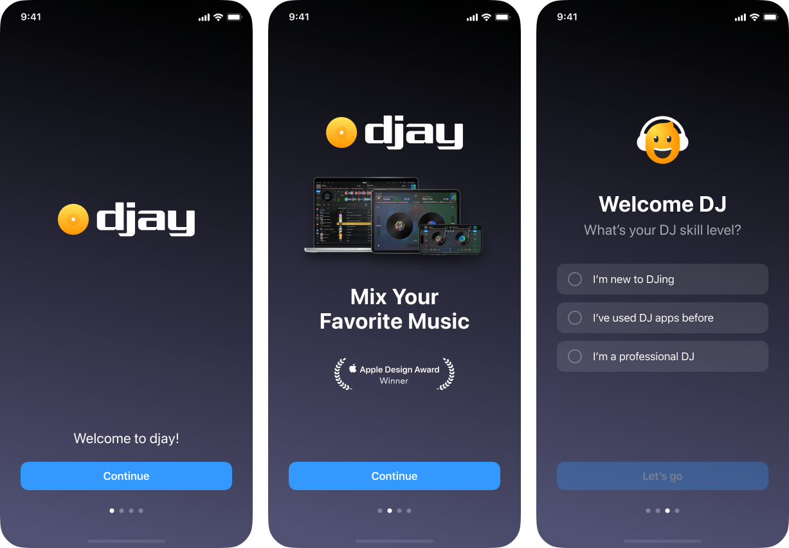

 

   

 

# 🎧 DJ Lorenzo Getting Started

On boarding example for a DJ app.

# Design

You can find the figma in the root directory. 

The onboarding adapts based on the user's DJ skill level. 
Each experience is designed to trigger the right emotion or reflex depending on their background.

### beginner 

The user doesn’t know anything about DJing.
To keep it simple and intuitive, they just have to slide the volume fader all the way up to continue.
It mimics a basic interaction, with an immediate and satisfying result.

### Intermediate

The user has already used DJ apps before.
Here, the goal is to reawaken muscle memory or nostalgia.
They can either:

- Push the volume to 50%, or
- Tap a sample button like kick or snare to trigger a familiar sound.

### Expert

The user is a DJ expert. There’s nothing to teach.
Instead, we simulate the tension and energy just before a live performance:

- You hear a crowd cheering
- Lights slowly fade in
- The moment just before the DJ walks on stage.

# 👨🏻‍🔧 Architecture

I use a modular approach with this structure : 

- Core package
	- DataDomain : data is handled here

- Design System package
	- Design System :  UI library used in app features

- Player 
	- Player : Player logic

I usually take a MVVM approach as it is a good balance between speed and quality. I didn't use it here because there's no much logic.

## External dependencies

- Factory for the injection. It's a library I use to cover multi module project.

## Navigation

Coordinator navigation pattern.

# 👨🏻‍💻 Discussion

## Design 

I think the landscape design can be improved and be completely different from the portrait mode. I just made it work on both direction but the experience is not exactly the same.

## UI technology

Many apps that were launched years ago were originally built using UIKit. It’s still a very solid way to build UI, and in some cases, it's even more performant than SwiftUI. SwiftUI has been around for a few years now, and it integrates well with UIKit.

At Deezer, our codebase uses both technologies. New screens are usually built with SwiftUI for several reasons:

- It’s the UI framework promoted by Apple going forward
- It offers a dedicated DSL for building UI
- It increases development velocity
- It includes a native preview system (even though previews can also be achieved with UIKit wrappers)

Personally, I enjoy working with SwiftUI for its clarity and speed, but I also know when UIKit is the right tool for the job.

## Unit tests

I didn't make unit tests as I didn't see much logic here.